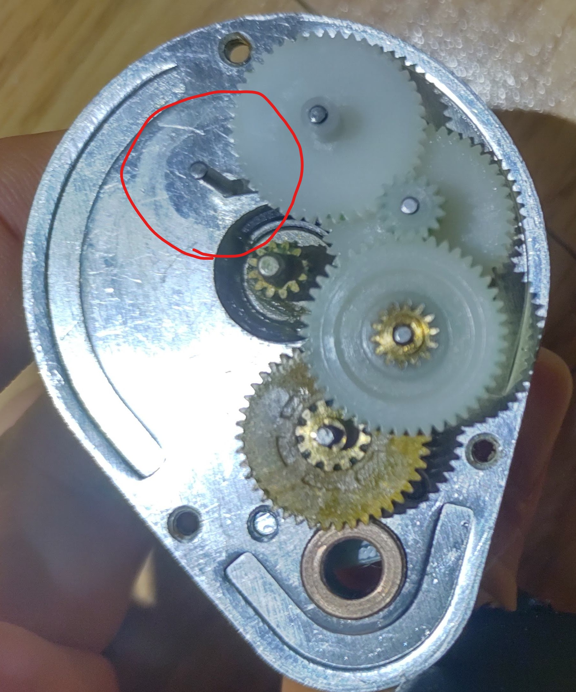
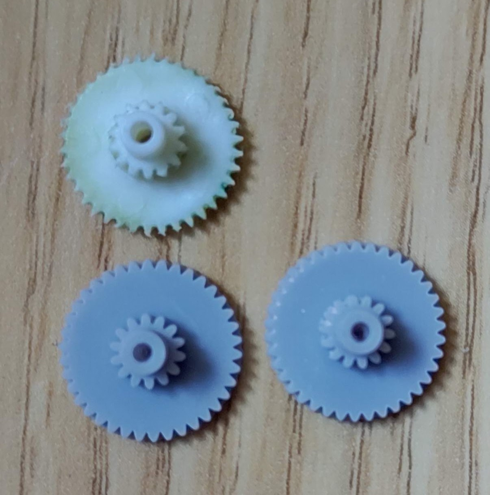
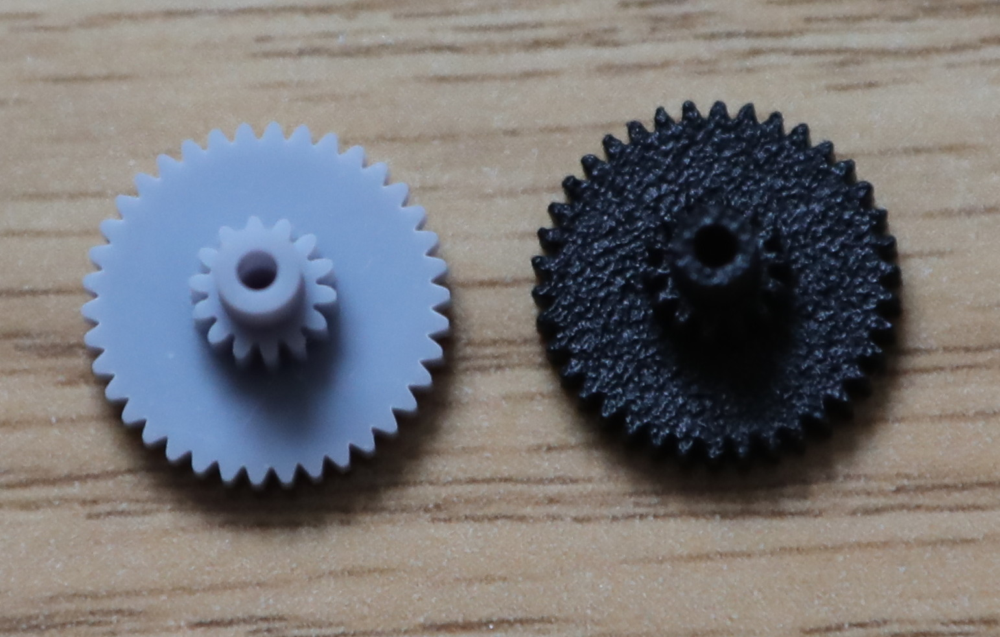

# Celestron NexStar SLT Geared Motor Replacement Gear

This project provides a 3D-printable replacement for a specific plastic gear within the **Celestron "SLT-F00-1A"** geared motor, commonly found in NexStar SLT, GT, and 4SE/5SE series telescopes. These motors may be also compatible with mounts from SkyWatcher SynScan AZ and Orion Starseeker III.

The original plastic gear is prone to wear, which often necessitates the full replacement of the geared motor. Since these motors are frequently out of stock, this project offers a durable, self-manufactured solution.

---

### Disclaimer: Use at Your Own Risk

This design is released under the **[TAPR Open Hardware License](https://tapr.org/the-tapr-open-hardware-license/)**. By using this design, you acknowledge that you are responsible for the manufacturing and use of the replacement gear. The creator of this project is not responsible for any damage to equipment or injury that may result from the use of this design.

---

### Identifying the Problem Gear

The target of this project is the **second-stage spur gear** in the gearbox. This gear is positioned directly after the pinion gear on the motor shaft and is often the first to show significant wear due to repeated use.

* You should replace this gear if:
    * The telescope's mount fails to rotate even though the motor can be heard running.
    * The telescope's mount slips or fails to track accurately.
    * The teeth on the gear are visibly worn down or chipped.

* Left image: The replacement gear's location inside the geared motor
* Center image: A damaged original gear and a 3D-printed resin gears
* Right image: left(gray): resin by SLA,  right(black): PA12 nylon by MJF

---

### Recommended Manufacturing Method and Material

Initial prototypes of this gear were successfully printed using an SLA (stereolithography) printer, which confirmed the design's fit and function. However, due to the low durability of typical SLA resins, this material is not recommended for long-term use.

For a durable and functional final product, the recommended material is **PA12 nylon using the Multi Jet Fusion (MJF) method**. This material is known for its excellent mechanical strength, high wear resistance, and toughness, making it ideal for gears.

---

### Design Information

The design is a two-stage spur gear with the following specifications:

* **Larger Gear:**
    * Teeth: 38t
    * Outer Diameter: ~13mm
    * Thickness: 2mm
    * Shaft Hole Diameter: 1.5mm
    * Module: ~0.33 (estimated)
* **Smaller Gear:**
    * Teeth: 14t
    * Outer Diameter: ~5mm
    * Thickness: 2.5mm
    * Shaft Hole Diameter: 1.5mm
    * Module: ~0.33 (estimated)

*Note: The module of 0.33 is not a standard value, so high-precision manufacturing (such as MJF) is essential to ensure proper gear meshing.*

---

### Files Included in This Repository

* [NexstarSLTGearbox2ndGear.stl](NexstarSLTGearbox2ndGear.stl): The 3D model file for printing.
* [NexstarSLTGearbox2ndGear.f3d](NexstarSLTGearbox2ndGear.f3d): The original Fusion 360 design file for modification.
* [LICENSE](LICENSE): The full text of the TAPR Open Hardware License.

---

### How to Replace the Gear

1.  Disassemble the Celestron "SLT-F00-1A" geared motor.
2.  Locate the worn second gear (refer to the images in this repository).
3.  Carefully remove the old gear from the shaft.
4.  Test the fit of the new 3D-printed gear on the 1.5mm shaft. The gear should slide onto the shaft with a minimal amount of friction, without any noticeable play or "wobble."
    * **If the fit is too tight:** Use a **1.5mm drill bit by hand** to gently ream the hole until the gear slides on smoothly. **Do not use a power drill**, as this can easily over-enlarge the hole and ruin the fit.
    * **If the fit is too loose:** The gear will not transfer power effectively. This indicates a problem with the print's dimensional accuracy. You may need to adjust your printer's settings or try a different material.
5.  With the new gear properly seated, reassemble the geared motor, ensuring all other components are in their correct positions.
